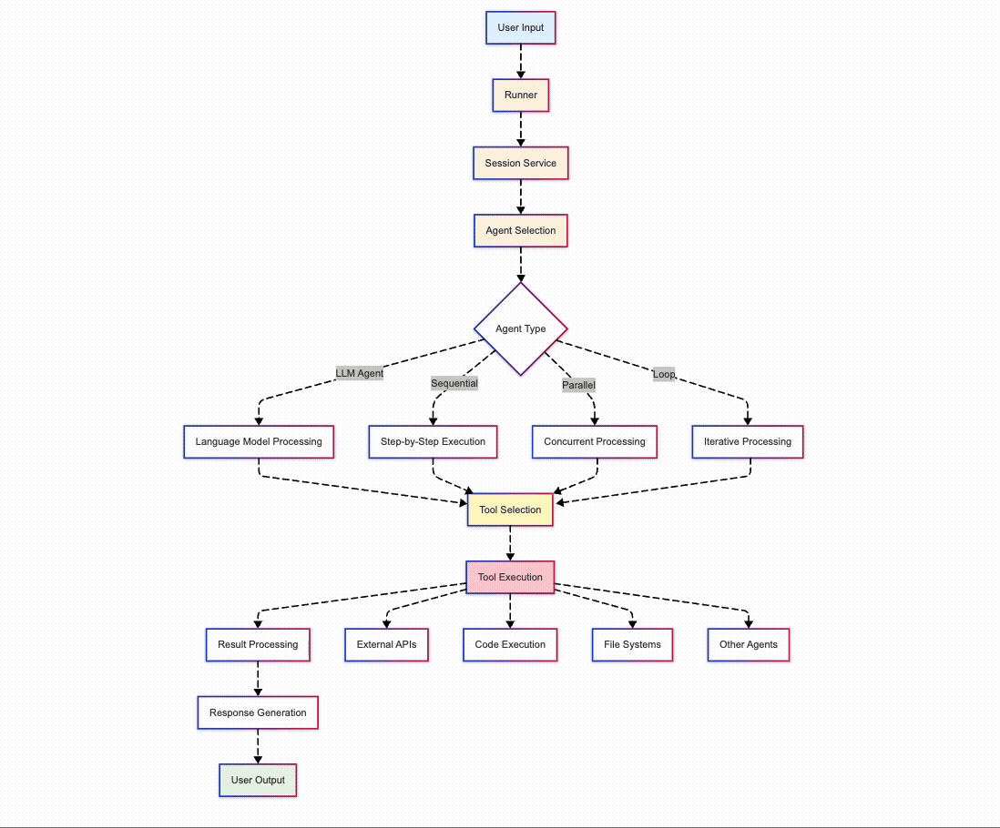

# Google ADK Comprehensive Samples

A collection of practical examples demonstrating Google's Agent Development Kit (ADK) capabilities. These samples showcase different agent types, tool integrations, and real-world use cases.

## 🏗️ ADK Architecture Overview



*Interactive architecture diagram showing how different ADK components work together*

## 🚀 Quick Start

### Prerequisites

- Python 3.11 or higher
- Google AI API key (Gemini)
- pip package manager

### Installation

1. **Clone the repository:**
   ```bash
   git clone https://github.com/pawankumar94/agent-development-kit-samples.git
   cd adk-samples-comprehensive
   ```

2. **Install dependencies:**
   ```bash
   pip install -r requirements.txt
   ```

3. **Set up your API key:**
   
   Create a `.env` file in the project root:
   ```bash
   GOOGLE_API_KEY=your_api_key_here
   ```
   
   Or set the environment variable:
   ```bash
   export GOOGLE_API_KEY=your_api_key_here
   ```

4. **Run a sample:**
   ```bash
   cd samples/01_basic_llm_agent
   python weather_assistant.py
   ```

## 📁 Project Structure

```
adk-samples-comprehensive/
├── README.md                    # This file
├── requirements.txt             # Python dependencies
├── config.py                   # Centralized configuration
├── .env.example               # Environment variables template
├── utils/                     # Shared utilities
│   └── session_helpers.py     # Session management helpers
└── samples/                   # Example implementations
    ├── 01_basic_llm_agent/    # Simple LLM agent with tools
    ├── 02_sequential_workflow/ # Step-by-step processing
    ├── 03_parallel_processing/ # Concurrent operations
    ├── 04_iterative_refinement/ # Loop-based improvement
    └── 05_multi_agent_system/  # Complex multi-agent setup
```

## 🤖 Sample Descriptions

### 1. Basic LLM Agent (`01_basic_llm_agent/`)
- **Purpose**: Demonstrates a simple LLM agent with custom tools
- **Features**: Weather checking, calculations, natural language processing
- **Use Case**: Personal assistant, simple automation

### 2. Sequential Workflow (`02_sequential_workflow/`)
- **Purpose**: Shows ordered, step-by-step processing
- **Features**: Data extraction, validation, formatting pipeline
- **Use Case**: Data processing, ETL operations, document workflows

### 3. Parallel Processing (`03_parallel_processing/`)
- **Purpose**: Demonstrates concurrent task execution
- **Features**: Multi-source data gathering, performance optimization
- **Use Case**: API aggregation, concurrent analysis, real-time dashboards

### 4. Iterative Refinement (`04_iterative_refinement/`)
- **Purpose**: Shows loop-based improvement processes
- **Features**: Quality analysis, iterative enhancement, condition-based termination
- **Use Case**: Content improvement, quality assurance, optimization

### 5. Multi-Agent System (`05_multi_agent_system/`)
- **Purpose**: Complex orchestration of multiple specialized agents
- **Features**: Agent coordination, task delegation, result aggregation
- **Use Case**: Research automation, complex workflows, enterprise solutions

## 🛠️ Configuration

The project uses a centralized configuration system in `config.py`. Key settings:

- **Model**: Default Gemini model for all agents
- **Session Management**: User IDs, session IDs, app names
- **Retry Logic**: Error handling and retry mechanisms
- **Logging**: Configurable logging levels

## 📖 Usage Examples

### Basic Usage
```python
from samples.basic_llm_agent.weather_assistant import create_weather_agent
from utils.session_helpers import run_simple_query

# Create and run an agent
agent = create_weather_agent()
response = run_simple_query(agent, "What's the weather in Tokyo?")
print(response)
```

### Advanced Usage with Session Management
```python
from utils.session_helpers import ADKSessionManager
from samples.sequential_workflow.data_processor import create_data_pipeline

# Create session manager
session_manager = ADKSessionManager(app_name="my_app")

# Create and configure agent
agent = create_data_pipeline()
runner = session_manager.create_runner(agent)

# Run queries
response = session_manager.run_query("Process this data: Hello World")
print(response)
```

## 🔧 Development

### Adding New Samples

1. Create a new directory under `samples/`
2. Follow the naming convention: `XX_descriptive_name/`
3. Include a main Python file and README.md
4. Use the shared configuration and utilities
5. Add comprehensive docstrings and comments

### Code Style

- Follow PEP 8 guidelines
- Use type hints where appropriate
- Include comprehensive docstrings
- Add error handling and logging
- Write clear, self-documenting code

## 🤝 Contributing

1. Fork the repository
2. Create a feature branch
3. Add your sample with documentation
4. Test thoroughly
5. Submit a pull request

## 📄 License

This project is licensed under the MIT License - see the LICENSE file for details.

## 🆘 Support

- **Documentation**: [Google ADK Documentation](https://cloud.google.com/vertex-ai/generative-ai/docs/agent-builder)
- **Issues**: Create an issue in this repository
- **Discussions**: Use GitHub Discussions for questions and ideas

## 🔗 Related Resources

- [Google ADK Official Documentation](https://cloud.google.com/vertex-ai/generative-ai/docs/agent-builder)
- [Gemini API Documentation](https://ai.google.dev/docs)
- [Agent Development Best Practices](https://cloud.google.com/vertex-ai/generative-ai/docs/agent-builder/best-practices)

---

**Note**: These samples are for educational and demonstration purposes. For production use, implement proper security measures, error handling, and monitoring. 